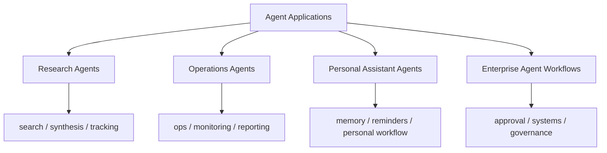

# Agent Application Landscape Map

## 怎么读这张图

- 这张图不是按模型能力分，而是按业务落地方向分
- 左边更偏知识工作和信息工作
- 右边更偏流程、系统接入和组织治理
- 个人助理和企业工作流虽然都叫 agent，但对记忆、权限、审批和风险的要求完全不同

## 推荐顺序

1. [[../05-Topics/Agent Applications|Agent Applications]]
2. [[../05-Topics/Research Agents|Research Agents]]
3. [[../05-Topics/Operations Agents|Operations Agents]]
4. [[../05-Topics/Personal Assistant Agents|Personal Assistant Agents]]
5. [[../05-Topics/Enterprise Agent Workflows|Enterprise Agent Workflows]]

## 关联

- [[../05-Topics/Topics Index|Topics Index]]
- [[../../AI-Learning/07-Maps/AI Agent Capability Map|AI Agent Capability Map]]
- [[../../AI-Engineering/08-Maps/Agent Evaluation and Governance Map|Agent Evaluation and Governance Map]]
