# Agent Industry Value Map

```mermaid
graph TD
    A["Agent Applications"] --> B["Customer Support"]
    A --> C["Enterprise Operations"]
    A --> D["Software Engineering"]
    A --> E["Sales and Revenue"]
    A --> F["Education"]
    A --> G["Public Sector"]

    B --> B1["Value: deflection, faster resolution, multilingual support"]
    B --> B2["Risk: wrong policy, bad actions, trust loss"]
    B --> B3["Cases: Klarna, Nubank, Salesforce, Decagon"]

    C --> C1["Value: workflow throughput, reusable analysis, auditability"]
    C --> C2["Risk: permissions, data leakage, silent drift"]
    C --> C3["Cases: OpenAI data agent, ServiceNow"]

    D --> D1["Value: faster drafts, review assist, shorter cycle time"]
    D --> D2["Risk: regressions, over-trust, hidden failure"]
    D --> D3["Cases: GitHub Copilot, Claude Code, Cursor, Codex"]

    E --> E1["Value: less admin work, faster follow-up, better pipeline visibility"]
    E --> E2["Risk: low trust, poor tone, bad CRM data"]
    E --> E3["Cases: Attention, Workato"]

    F --> F1["Value: teacher leverage, feedback support, scalable AI literacy"]
    F --> F2["Risk: integrity, age fit, privacy, poor pedagogy"]
    F --> F3["Cases: MagicSchool, CSU"]

    G --> G1["Value: paperwork reduction, translation, internal knowledge access"]
    G --> G2["Risk: compliance, security, public trust, accountability"]
    G --> G3["Cases: ChatGPT Gov, Pennsylvania pilot"]

    B2 --> H["Governance"]
    C2 --> H
    D2 --> H
    E2 --> H
    F2 --> H
    G2 --> H

    H --> H1["Approval Gates"]
    H --> H2["Evaluation"]
    H --> H3["Failure Recovery"]
    H --> H4["ROI and Adoption"]
```

## 怎么看这张图

- 左边看行业落地位置
- 中间看价值来源
- 右边看风险与代表案例
- 底部看无论落在哪个行业，都绕不开的治理要求
- 新补的教育与公共部门，帮助我们看“高信任行业”与普通商业场景的差异

## 关联

- [[../01-Industries/Industries Index|Industries Index]]
- [[../04-Case-Studies/Case Studies Index|Case Studies Index]]
- [[../05-Topics/Agent Applications|Agent Applications]]
- [[Agent Application Landscape Map]]
- [[Regulated Industry Agent Map]]
