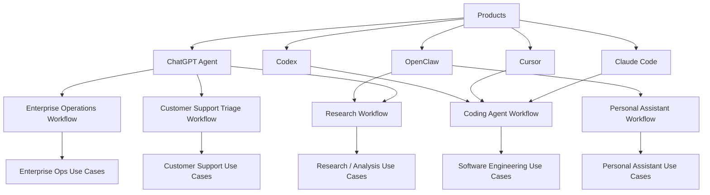

# Agent Product and Workflow Map

## 怎么看这张图

- 先看一个产品更自然地落到哪类 workflow
- 再看 workflow 对应的是哪类应用价值
- 这样可以避免只按“产品名字”学习，而忽略真正的使用路径

## 关联

- [[../02-Products/Products Index|Products Index]]
- [[../03-Workflows/Workflows Index|Workflows Index]]
- [[Agent Application Landscape Map]]
