# Agent Vendor Fit Map

```mermaid
graph TD
    A["Application Fit"] --> B["ChatGPT Agent"]
    A --> C["Claude Code"]
    A --> D["Cursor"]
    A --> E["Codex"]
    A --> F["OpenClaw"]

    B --> B1["Research / Web Tasks"]
    B --> B2["Enterprise Ops"]
    B --> B3["High-Trust Tasks With Strong Review"]
    B --> B4["Back-Office Analyst Copilots"]

    C --> C1["Terminal-First Coding"]
    C --> C2["Scriptable Engineering Work"]
    C --> C3["Building Internal Ops Agents"]

    D --> D1["IDE-Native Coding"]
    D --> D2["Team Background Agents"]
    D --> D3["Building Internal Ops Agents"]

    E --> E1["Cloud Background Coding"]
    E --> E2["Parallel Coding Tasks"]
    E --> E3["Cloud Buildout for Internal Agent Systems"]

    F --> F1["Self-Hosted Assistant Runtime"]
    F --> F2["Internal Knowledge Work"]
    F --> F3["Long-Running, Memory-Heavy Workflows"]
    F --> F4["Self-Hosted Back-Office Operations"]
```

## 怎么看这张图

- 这张图不回答“谁最好”，而回答“谁最适合哪种默认工作方式”
- 左边是产品，右边是它天然顺手的应用落点
- 真正做选型时，应该再叠加：治理、部署边界、成本、系统接入深度和组织能力

## 关联

- [[../05-Topics/Agent Product Fit and Vendor Tradeoffs|Agent Product Fit and Vendor Tradeoffs]]
- [[Agent Product and Workflow Map]]
