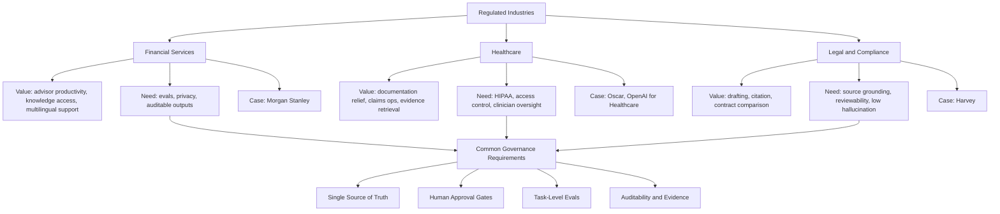

# Regulated Industry Agent Map

## 怎么看这张图

- 这张图不是讲行业大小，而是讲“高监管行业里，agent 为什么难，又为什么值”
- 三个行业的共同点是：价值高，但治理要求更高
- 越进入真实生产环境，越要把 eval、审批、证据和审计能力前置

## 关联

- [[../01-Industries/Financial Services Agents|Financial Services Agents]]
- [[../01-Industries/Healthcare Agents|Healthcare Agents]]
- [[../01-Industries/Legal and Compliance Agents|Legal and Compliance Agents]]
- [[Agent Industry Value Map]]
