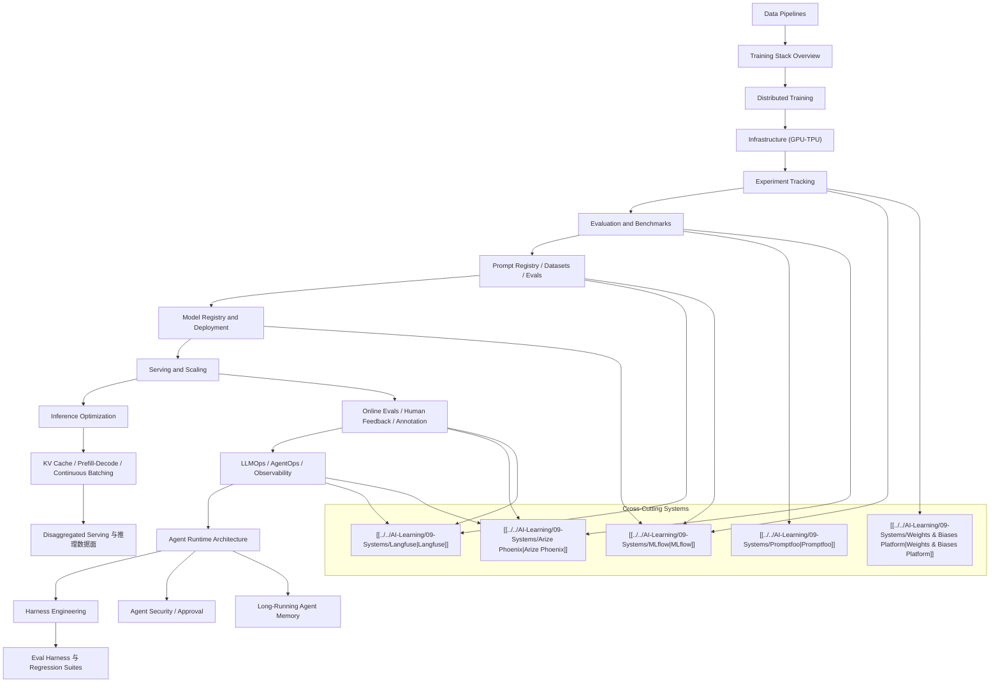

# AI Engineering Stack Map

## 地图目标

- 用一张图串起数据、训练、评测、推理、部署、LLMOps 和 agent runtime 全链路

## 怎么读

- 左半边更偏经典 AI engineering 生命周期
- 中间是 `MLOps / LLMOps` 的治理与发布主线
- 右半边是 inference 与 agent runtime 的生产化延伸

## 关联

- [[../07-Topics/主题索引|主题索引]]
- [[MLOps 与 LLMOps 工程图]]
- [[Inference and Serving Map]]
- [[Agent Runtime Engineering Map]]
