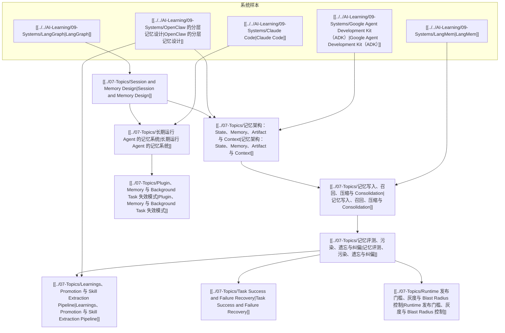

# AI Memory Engineering Map

## 怎么读

- 从 `Session and Memory Design` 开始，先把 state / memory 边界划清
- 再读 `记忆架构` 与 `写入/召回/压缩`
- 然后看 `Learnings、Promotion 与 Skill Extraction Pipeline`，理解什么时候该从 memory 进入 durable rules 和 skills
- 最后读 `评测、污染、遗忘与纠偏`，建立长期运行判断力

## 关联

- [[地图索引]]
- [[../../AI-Learning/07-Maps/AI 记忆设计图|AI 记忆设计图]]
- [[../../AI-Learning/07-Maps/AI 记忆学习导航.base|AI 记忆学习导航（Base）]]
