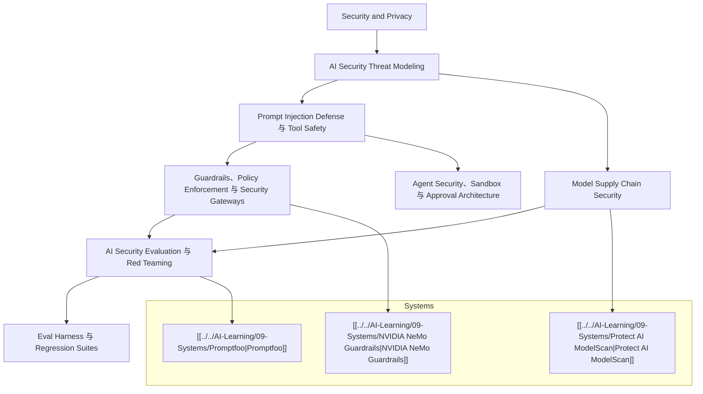

# AI Security Engineering Map

```mermaid
flowchart TD
  SP["Security and Privacy"] --> TM["AI Security Threat Modeling"]
  TM --> PI["Prompt Injection Defense 与 Tool Safety"]
  TM --> MS["Model Supply Chain Security"]
  PI --> GR["Guardrails、Policy Enforcement 与 Security Gateways"]
  PI --> AP["Agent Security、Sandbox 与 Approval Architecture"]
  GR --> RT["AI Security Evaluation 与 Red Teaming"]
  MS --> RT
  RT --> EVAL["Eval Harness 与 Regression Suites"]

  subgraph systems["Systems"]
    NG["[[../../AI-Learning/09-Systems/NVIDIA NeMo Guardrails|NVIDIA NeMo Guardrails]]"]
    MSCAN["[[../../AI-Learning/09-Systems/Protect AI ModelScan|Protect AI ModelScan]]"]
    PFO["[[../../AI-Learning/09-Systems/Promptfoo|Promptfoo]]"]
  end

  GR --> NG
  MS --> MSCAN
  RT --> PFO
```

## 关联

- [[../07-Topics/主题索引|主题索引]]
- [[../../AI-Learning/07-Maps/AI Security Threat Map|AI Security Threat Map]]
- [[Agent Runtime Engineering Map]]
