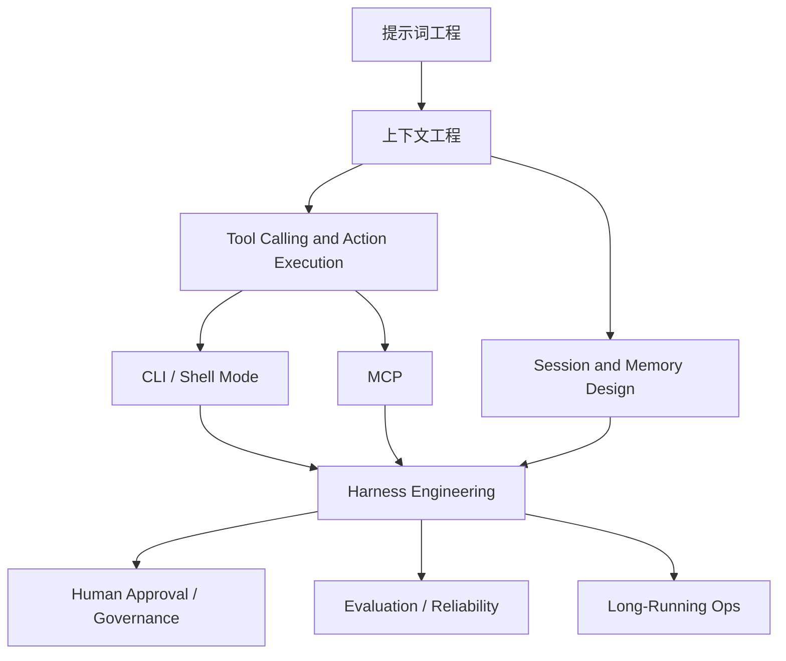

# Agent Context and Integration Engineering Map

## 怎么读这张图

- 从 `提示词工程` 进入，最初只是 instruction 设计
- 到 `上下文工程`，问题开始变成信息装配与状态组织
- 一旦进入 `tool calling`，就会遇到 `CLI` 和 `MCP` 两种典型动作接入模式
- 再往上，真正成熟的 agent 系统会落到 `Harness Engineering`
- 最后才会自然连接到 approval、evaluation、ops 等治理层

## 推荐顺序

1. [[../../AI-Learning/06-Topics/提示词工程|提示词工程]]
2. [[../../AI-Learning/06-Topics/上下文工程|上下文工程]]
3. [[../../AI-Learning/06-Topics/MCP（Model Context Protocol）|MCP（Model Context Protocol）]]
4. [[../07-Topics/Tool Calling and Action Execution|Tool Calling and Action Execution]]
5. [[../07-Topics/MCP 与 CLI 模式|MCP 与 CLI 模式]]
6. [[../07-Topics/Harness Engineering|Harness Engineering]]
7. [[../07-Topics/Human-in-the-Loop and Approval Gates|Human-in-the-Loop and Approval Gates]]
8. [[../07-Topics/Agent Evaluation and Reliability|Agent Evaluation and Reliability]]

## 关联

- [[Maps Index]]
- [[Agent Runtime Engineering Map]]
- [[Coding Agent Workflow Engineering Map]]
- [[Agent Evaluation and Governance Map]]
- [[../../AI-Learning/07-Maps/Agent Prompt-Context-Harness Map|Agent Prompt-Context-Harness Map]]
