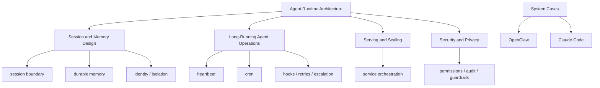

# Agent Runtime Engineering Map

## 怎么读这张图

- `Agent Runtime Architecture` 是总骨架
- `Session and Memory Design` 解决连续性与持久性
- `Long-Running Agent Operations` 解决长期运行、主动触发和治理
- 这些主题再和 serving、安全、成本交叉，才构成真实 agent 系统

## 关联

- [[../07-Topics/Agent Runtime Architecture|Agent Runtime Architecture]]
- [[../07-Topics/Session and Memory Design|Session and Memory Design]]
- [[../07-Topics/Long-Running Agent Operations|Long-Running Agent Operations]]
- [[../07-Topics/Serving and Scaling|Serving and Scaling]]
- [[../07-Topics/Security and Privacy|Security and Privacy]]
- [[../../AI-Learning/09-Systems/OpenClaw|OpenClaw]]
