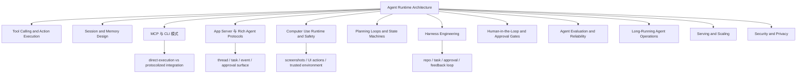

# Agent Runtime Engineering Map

## 怎么读这张图

- `Agent Runtime Architecture` 是总骨架
- `Tool Calling and Action Execution` 解决动作层如何真正执行
- `Session and Memory Design` 解决连续性与持久性
- `MCP 与 CLI 模式` 解决动作面如何暴露给 agent
- `App Server 与 Rich Agent Protocols` 解决完整任务会话如何暴露给客户端
- `Computer Use Runtime and Safety` 解决 UI 动作面为何既强大又高风险
- `Harness Engineering` 则把这些东西收进一个完整、可观察、可治理的工作台

## 关联

- [[../07-Topics/Agent Runtime Architecture|Agent Runtime Architecture]]
- [[../07-Topics/Tool Calling and Action Execution|Tool Calling and Action Execution]]
- [[../07-Topics/Session and Memory Design|Session and Memory Design]]
- [[../07-Topics/MCP 与 CLI 模式|MCP 与 CLI 模式]]
- [[../07-Topics/App Server 与 Rich Agent Protocols|App Server 与 Rich Agent Protocols]]
- [[../07-Topics/Computer Use Runtime and Safety|Computer Use Runtime and Safety]]
- [[../07-Topics/Harness Engineering|Harness Engineering]]
- [[../07-Topics/Planning Loops and State Machines|Planning Loops and State Machines]]
- [[../07-Topics/Human-in-the-Loop and Approval Gates|Human-in-the-Loop and Approval Gates]]
- [[../07-Topics/Agent Evaluation and Reliability|Agent Evaluation and Reliability]]
- [[Agent Context and Integration Engineering Map]]
- [[Agent Action Surfaces and Protocols Map]]
- [[Agent Evaluation and Governance Map]]
- [[../../AI-Learning/09-Systems/OpenClaw|OpenClaw]]
- [[../../AI-Learning/09-Systems/Claude Code|Claude Code]]
- [[../../AI-Learning/09-Systems/Codex|Codex]]
