# Agent Runtime Engineering Map

```mermaid
flowchart TD
  A["Agent Runtime Architecture"] --> A1["Tool Calling and Action Execution"]
  A --> B["Session and Memory Design"]
  A --> A2["Planning Loops and State Machines"]
  A --> A3["Human-in-the-Loop and Approval Gates"]
  A --> A4["Agent Evaluation and Reliability"]
  A --> C["Long-Running Agent Operations"]
  A --> M["MCP 与 CLI 模式"]
  A --> H["Harness Engineering"]
  A --> D["Serving and Scaling"]
  A --> E["Security and Privacy"]

  B --> B1["session boundary"]
  B --> B2["durable memory"]
  B --> B3["identity / isolation"]

  M --> M1["direct execution vs protocolized integration"]
  H --> H1["repo / task / approval / feedback loop"]

  C --> C1["heartbeat"]
  C --> C2["cron"]
  C --> C3["hooks / retries / escalation"]

  D --> D1["service orchestration"]
  E --> E1["permissions / audit / guardrails"]

  F["System Cases"] --> G["OpenClaw"]
  F --> H2["Claude Code"]
  F --> I["Codex"]
```

## 怎么读这张图

- `Agent Runtime Architecture` 是总骨架
- `Tool Calling and Action Execution` 解决动作层如何真正执行
- `Session and Memory Design` 解决连续性与持久性
- `MCP 与 CLI 模式` 解决动作面到底如何暴露给 agent
- `Harness Engineering` 解决任务环境、反馈回路和可读性如何被收进一个完整工作台
- `Planning Loops and State Machines`、approval、evaluation、ops 则决定这套 runtime 是否能长期稳定运行

## 关联

- [[../07-Topics/Agent Runtime Architecture|Agent Runtime Architecture]]
- [[../07-Topics/Tool Calling and Action Execution|Tool Calling and Action Execution]]
- [[../07-Topics/Session and Memory Design|Session and Memory Design]]
- [[../07-Topics/MCP 与 CLI 模式|MCP 与 CLI 模式]]
- [[../07-Topics/Harness Engineering|Harness Engineering]]
- [[../07-Topics/Planning Loops and State Machines|Planning Loops and State Machines]]
- [[../07-Topics/Human-in-the-Loop and Approval Gates|Human-in-the-Loop and Approval Gates]]
- [[../07-Topics/Agent Evaluation and Reliability|Agent Evaluation and Reliability]]
- [[../07-Topics/Long-Running Agent Operations|Long-Running Agent Operations]]
- [[Agent Context and Integration Engineering Map]]
- [[Agent Evaluation and Governance Map]]
- [[../07-Topics/Serving and Scaling|Serving and Scaling]]
- [[../07-Topics/Security and Privacy|Security and Privacy]]
- [[../../AI-Learning/09-Systems/OpenClaw|OpenClaw]]
- [[../../AI-Learning/09-Systems/Claude Code|Claude Code]]
- [[../../AI-Learning/09-Systems/Codex|Codex]]
