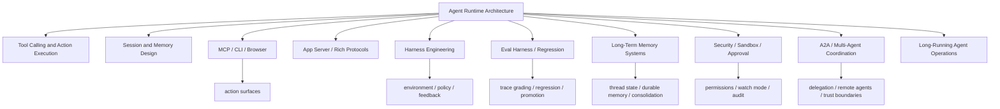

# Agent Runtime Engineering Map

## 怎么读这张图

- runtime 不是单点技术，而是一组必须同时成立的工程能力
- `action surfaces` 解决“能不能动”
- `memory systems` 解决“能不能持续”
- `security / approval` 解决“能不能放心动”
- `eval harness` 解决“怎么知道它变好了”
- `A2A / coordination` 解决“多个 agent 怎么跨边界协作”

## 关联

- [[../07-Topics/Agent Runtime Architecture|Agent Runtime Architecture]]
- [[../07-Topics/MCP 与 CLI 模式|MCP 与 CLI 模式]]
- [[../07-Topics/App Server 与 Rich Agent Protocols|App Server 与 Rich Agent Protocols]]
- [[../07-Topics/Computer Use Runtime and Safety|Computer Use Runtime and Safety]]
- [[../07-Topics/Harness Engineering|Harness Engineering]]
- [[../07-Topics/Eval Harness 与 Regression Suites|Eval Harness 与 Regression Suites]]
- [[../07-Topics/长期运行 Agent 的记忆系统|长期运行 Agent 的记忆系统]]
- [[../07-Topics/Agent Security、Sandbox 与 Approval Architecture|Agent Security、Sandbox 与 Approval Architecture]]
- [[../07-Topics/A2A 与 Multi-Agent Coordination|A2A 与 Multi-Agent Coordination]]
- [[../07-Topics/Long-Running Agent Operations|Long-Running Agent Operations]]
- [[Agent Context and Integration Engineering Map]]
- [[Agent 协作、记忆与信任边界图]]
