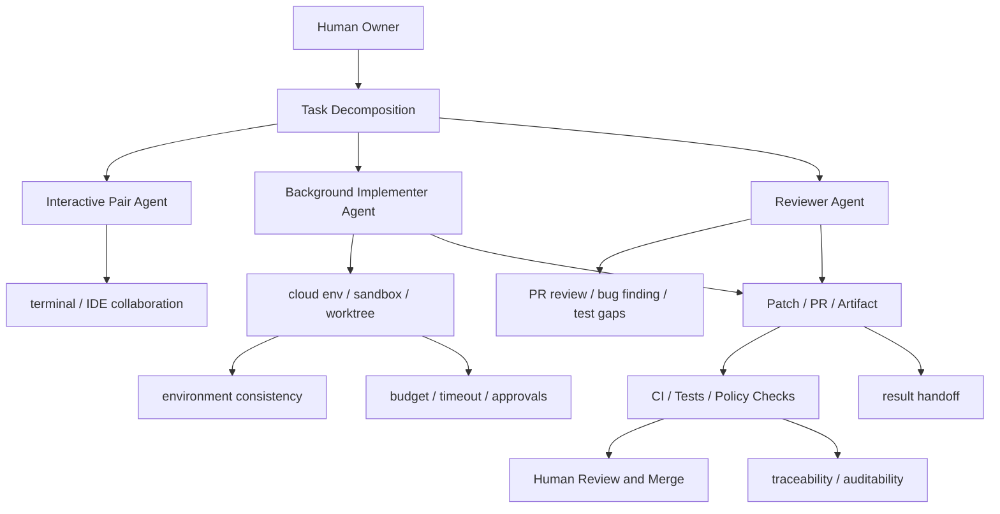

# Coding Agent Workflow Engineering Map

## 怎么读这张图

- 这张图关注的是 coding agent 怎么进入真实软件工程流程
- 左边更偏任务拆分与角色分工
- 中间更偏执行环境和结果回收
- 右边更偏治理、审查和合并控制

## 相关

- [[../07-Topics/Background Agents|Background Agents]]
- [[../07-Topics/Delegation and Task-Oriented Agents|Delegation and Task-Oriented Agents]]
- [[../07-Topics/Multi-Agent Coding Workflow|Multi-Agent Coding Workflow]]
- [[Agent Runtime Engineering Map]]
