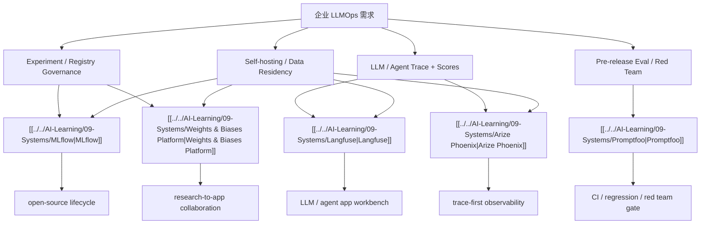

# Enterprise LLMOps Vendor Choice Map

## 怎么读

- 先不要问“谁最好”
- 先问“我们现在最缺哪一层控制点”
- 再看 deployment 模式和数据边界是否允许

## 关联

- [[../07-Topics/Enterprise MLOps 与 LLMOps Vendor Tradeoffs|Enterprise MLOps 与 LLMOps Vendor Tradeoffs]]
- [[../07-Topics/Open-Source、Self-Hosting 与 Managed LLMOps|Open-Source、Self-Hosting 与 Managed LLMOps]]
- [[../06-Projects/Enterprise LLMOps/README|Enterprise LLMOps]]
