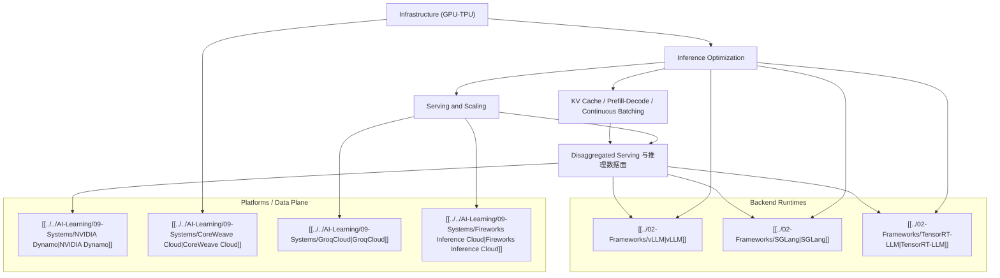

# Inference and Serving Map

## 这张图想说明什么

- `Infrastructure` 提供的是物理与集群边界
- `Inference Optimization` 解决的是成本、吞吐、延迟和利用率
- `Serving and Scaling` 解决的是线上产品化和多租户稳定性
- `KV Cache / Prefill-Decode / Continuous Batching` 是现代 runtime 的核心系统问题
- `Disaggregated Serving` 是把这些问题再提升到数据面层

## 推荐顺序

1. [[../07-Topics/Infrastructure (GPU-TPU)|Infrastructure (GPU-TPU)]]
2. [[../07-Topics/Inference Optimization|Inference Optimization]]
3. [[../07-Topics/Serving and Scaling|Serving and Scaling]]
4. [[../07-Topics/KV Cache、Prefill-Decode 与 Continuous Batching|KV Cache、Prefill-Decode 与 Continuous Batching]]
5. [[../07-Topics/Disaggregated Serving 与推理数据面|Disaggregated Serving 与推理数据面]]
6. [[../02-Frameworks/vLLM|vLLM]]
7. [[../02-Frameworks/SGLang|SGLang]]
8. [[../02-Frameworks/TensorRT-LLM|TensorRT-LLM]]
9. [[../../AI-Learning/09-Systems/NVIDIA Dynamo|NVIDIA Dynamo]]

## 关联

- [[AI Engineering Stack Map]]
- [[../07-Topics/Topics Index|Topics Index]]
- [[../../AI-Learning/07-Maps/AI Infra 与推理服务生态图|AI Infra 与推理服务生态图]]
