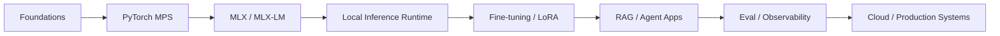

# Mac 本地 AI 专家路径图

```mermaid
flowchart LR
  A["Foundations"] --> B["PyTorch MPS"]
  B --> C["MLX / MLX-LM"]
  C --> D["Local Inference Runtime"]
  D --> E["Fine-tuning / LoRA"]
  E --> F["RAG / Agent Apps"]
  F --> G["Eval / Observability"]
  G --> H["Cloud / Production Systems"]
```
