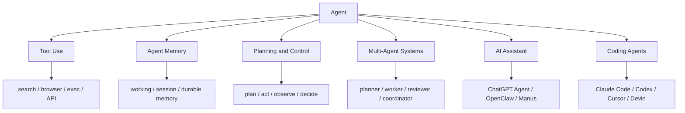

# AI Agent Capability Map

## 怎么读这张图

- `Agent` 是总概念
- `Tool Use` 决定系统是否真正能行动
- `Agent Memory` 决定系统能否跨回合持续工作
- `Planning and Control` 决定系统是否能在多步任务中保持稳定
- `Multi-Agent Systems` 则是把这些能力进一步组织成分工协作模式
- `AI Assistant` 和 `Coding Agents` 是两个高价值产品化方向

## 推荐顺序

1. [[../06-Topics/Agent|Agent]]
2. [[../06-Topics/Tool Use|Tool Use]]
3. [[../06-Topics/Agent Memory|Agent Memory]]
4. [[../06-Topics/Planning and Control|Planning and Control]]
5. [[../06-Topics/AI Assistant|AI Assistant]]
6. [[../06-Topics/Coding Agents|Coding Agents]]
7. [[../06-Topics/Multi-Agent Systems|Multi-Agent Systems]]
8. [[AI Agent Systems Map]]
9. [[AI Agent Product Positioning Map]]
10. [[AI Coding Agent Positioning Map]]

## 关联

- [[../06-Topics/AI Topics Index|AI Topics Index]]
- [[AI Agent Systems Map]]
- [[AI Agent Product Positioning Map]]
- [[AI Coding Agent Positioning Map]]
- [[../../AI-Engineering/07-Topics/Agent Runtime Architecture|Agent Runtime Architecture]]
