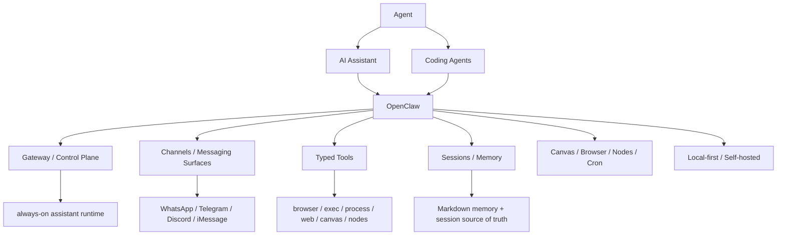

# AI Agent Systems Map

## 怎么读这张图

- `Agent` 是抽象能力层：模型 + 工具 + 状态 +执行循环
- `AI Assistant` 是产品层：面向用户的任务完成入口
- `Coding Agents` 是高价值垂直场景：代码理解、修改、测试、反馈循环
- `OpenClaw` 值得学的地方，是它把 agent/assistant/coding-agent 推进到了“系统运行层”
- 如果你想看更宽的产品定位差异，再看 [[AI Agent Product Positioning Map]]

## 推荐顺序

1. [[../06-Topics/Agent|Agent]]
2. [[../06-Topics/AI Assistant|AI Assistant]]
3. [[../06-Topics/Coding Agents|Coding Agents]]
4. [[../09-Systems/OpenClaw|OpenClaw]]
5. [[../09-Systems/OpenClaw 工作原理与架构|OpenClaw 工作原理与架构]]
6. [[../09-Systems/OpenClaw 的准自进化工作流|OpenClaw 的准自进化工作流]]
7. [[OpenClaw Architecture Map]]
8. [[OpenClaw 准自进化工作流图]]
9. [[AI Agent Product Positioning Map]]

## 关联

- [[../06-Topics/AI Topics Index|AI Topics Index]]
- [[../06-Topics/Agent|Agent]]
- [[../06-Topics/AI Assistant|AI Assistant]]
- [[../06-Topics/Coding Agents|Coding Agents]]
- [[../09-Systems/OpenClaw|OpenClaw]]
- [[../09-Systems/OpenClaw 工作原理与架构|OpenClaw 工作原理与架构]]
- [[../09-Systems/OpenClaw 的准自进化工作流|OpenClaw 的准自进化工作流]]
- [[../09-Systems/OpenClaw、ChatGPT 与 Claude Code 的定位差异|OpenClaw、ChatGPT 与 Claude Code 的定位差异]]
- [[../09-Systems/ChatGPT Agent|ChatGPT Agent]]
- [[../09-Systems/Manus|Manus]]
- [[../09-Systems/AI Agent Systems 对比：OpenClaw、ChatGPT Agent、Claude Code、Manus|AI Agent Systems 对比：OpenClaw、ChatGPT Agent、Claude Code、Manus]]
- [[OpenClaw Architecture Map]]
- [[OpenClaw 准自进化工作流图]]
- [[AI Agent Product Positioning Map]]
- [[AI Ecosystem Map]]
