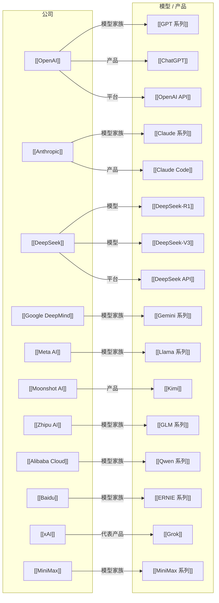

# AI Company-Models Map

> 这一张图只看公司与代表模型 / 产品的关系。

## 怎么看这张图

- 这张图适合用来理解“公司如何把能力落成模型和产品”
- 同一家公司下可以继续补产品层、API 层、模型家族层
- 如果以后公司变多，建议按国家或阵营拆分成多张图

## 返回

- [[AI Ecosystem Map]]
- [[AI Company-People Map]]
- [[AI Topic-Papers Map]]
