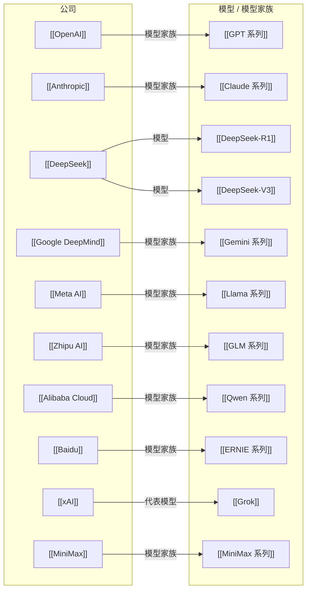

# AI Company-Models Map

> 这一张图只看公司与代表模型 / 模型家族的关系。产品、平台和 runtime 请看 `AI Company-Systems Map`。

## 怎么看这张图

- 这张图适合用来理解“公司如何把能力落成模型家族与代表模型”
- 同一家公司下可以继续拆模型家族、代表模型、论文依赖
- 产品层、平台层、runtime 层请转到 [[AI Company-Systems Map]]
- 如果以后公司变多，建议按国家或阵营拆分成多张图

## 返回

- [[AI Ecosystem Map]]
- [[AI Company-People Map]]
- [[AI Company-Systems Map]]
- [[AI Topic-Papers Map]]
