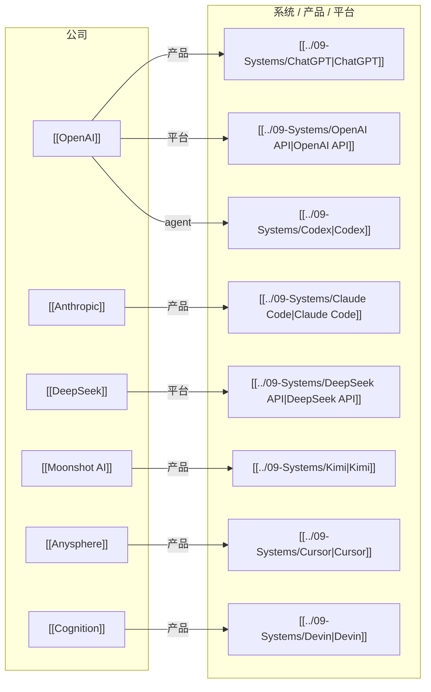

# AI Company-Systems Map

> 这一张图只看公司与具体系统 / 产品 / 平台的关系。

## 怎么看这张图

- 这张图适合回答“公司把能力落成了什么系统入口”
- `Model` 和 `System` 是两层：一个更偏能力，一个更偏产品/平台/工作入口
- `OpenClaw` 更像跨公司生态里的 runtime 案例，所以放在 `AI Agent Systems Map` 里更合适
- `Anysphere` 和 `Cognition` 的加入，代表公司层已经开始覆盖 agent-native developer tool 公司

## 返回

- [[AI Ecosystem Map]]
- [[AI Company-People Map]]
- [[AI Company-Models Map]]
- [[AI Agent Systems Map]]
