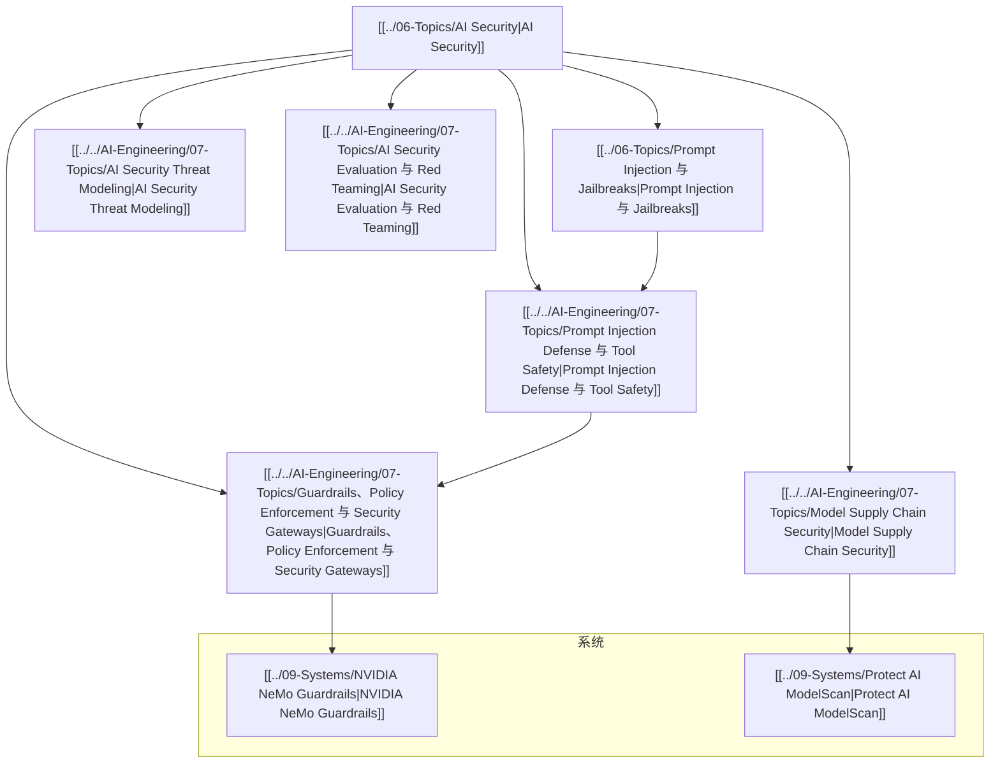

# AI Security Threat Map

```mermaid
flowchart TD
  S["[[../06-Topics/AI Security|AI Security]]"] --> PI["[[../06-Topics/Prompt Injection 与 Jailbreaks|Prompt Injection 与 Jailbreaks]]"]
  S --> TM["[[../../AI-Engineering/07-Topics/AI Security Threat Modeling|AI Security Threat Modeling]]"]
  S --> PD["[[../../AI-Engineering/07-Topics/Prompt Injection Defense 与 Tool Safety|Prompt Injection Defense 与 Tool Safety]]"]
  S --> GR["[[../../AI-Engineering/07-Topics/Guardrails、Policy Enforcement 与 Security Gateways|Guardrails、Policy Enforcement 与 Security Gateways]]"]
  S --> MS["[[../../AI-Engineering/07-Topics/Model Supply Chain Security|Model Supply Chain Security]]"]
  S --> RT["[[../../AI-Engineering/07-Topics/AI Security Evaluation 与 Red Teaming|AI Security Evaluation 与 Red Teaming]]"]

  subgraph systems["系统"]
    NG["[[../09-Systems/NVIDIA NeMo Guardrails|NVIDIA NeMo Guardrails]]"]
    MSCAN["[[../09-Systems/Protect AI ModelScan|Protect AI ModelScan]]"]
  end

  PI --> PD
  PD --> GR
  MS --> MSCAN
  GR --> NG
```

## 怎么读

- 左边是抽象威胁与方法论
- 右边是工程控制层
- 最右是具体安全系统

## 关联

- [[AI Ecosystem Map]]
- [[../../AI-Engineering/08-Maps/AI Security Engineering Map|AI Security Engineering Map]]
