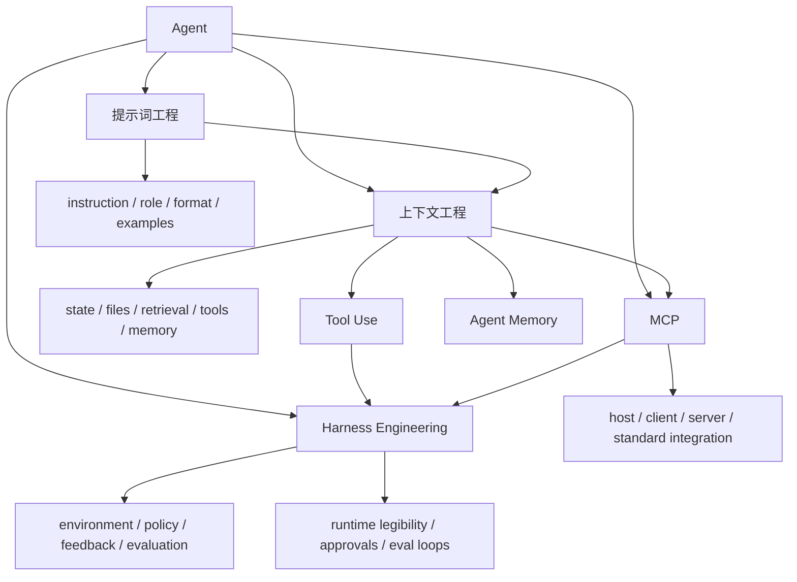

# Agent Prompt-Context-Harness Map

## 怎么读这张图

- `提示词工程` 是最早的一层：把任务说清楚
- `上下文工程` 开始处理模型到底看到了什么环境
- `MCP` 是外部能力接入的一种协议化方式
- `Harness Engineering` 则把上下文、工具、协议、反馈回路和治理边界一起收进来

所以这不是四个孤立词，而是一条明显的演进线。

## 推荐顺序

1. [[../06-Topics/提示词工程|提示词工程]]
2. [[../06-Topics/上下文工程|上下文工程]]
3. [[../06-Topics/MCP（Model Context Protocol）|MCP（Model Context Protocol）]]
4. [[../06-Topics/Tool Use|Tool Use]]
5. [[../06-Topics/Agent Memory|Agent Memory]]
6. [[../../AI-Engineering/07-Topics/MCP 与 CLI 模式|MCP 与 CLI 模式]]
7. [[../../AI-Engineering/07-Topics/Harness Engineering|Harness Engineering]]

## 关联

- [[AI Agent Capability Map]]
- [[AI Agent Systems Map]]
- [[../06-Topics/AI Topics Index|AI Topics Index]]
- [[../../AI-Engineering/08-Maps/Agent Context and Integration Engineering Map|Agent Context and Integration Engineering Map]]
