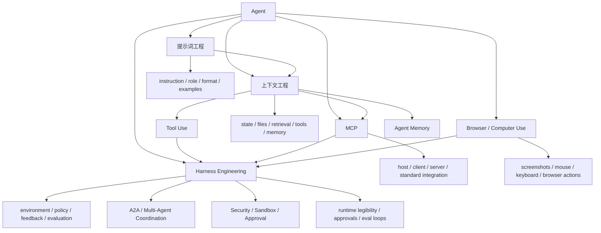

# Agent Prompt-Context-Harness Map

## 怎么读这张图

- `提示词工程` 是最早的一层：把任务说清楚
- `上下文工程` 开始处理模型到底看到了什么环境
- `MCP` 是外部能力接入的一种协议化方式
- `Browser / Computer Use` 把 agent 推进到真实 UI 动作面
- `Harness Engineering` 把上下文、工具、协议、动作面、反馈回路和治理边界一起收进来
- 当系统继续长大时，就会自然走到：
  - `A2A / Multi-Agent Coordination`
  - `Security / Sandbox / Approval`
  - `Eval Harness`

## 推荐顺序

1. [[../06-Topics/提示词工程|提示词工程]]
2. [[../06-Topics/上下文工程|上下文工程]]
3. [[../06-Topics/MCP（Model Context Protocol）|MCP（Model Context Protocol）]]
4. [[../06-Topics/Browser Agents 与 Computer Use|Browser Agents 与 Computer Use]]
5. [[../06-Topics/Tool Use|Tool Use]]
6. [[../06-Topics/Agent Memory|Agent Memory]]
7. [[../06-Topics/Multi-Agent Systems|Multi-Agent Systems]]
8. [[../06-Topics/A2A（Agent-to-Agent）与协作协议|A2A（Agent-to-Agent）与协作协议]]
9. [[../../AI-Engineering/07-Topics/MCP 与 CLI 模式|MCP 与 CLI 模式]]
10. [[../../AI-Engineering/07-Topics/App Server 与 Rich Agent Protocols|App Server 与 Rich Agent Protocols]]
11. [[../../AI-Engineering/07-Topics/Computer Use Runtime and Safety|Computer Use Runtime and Safety]]
12. [[../../AI-Engineering/07-Topics/Harness Engineering|Harness Engineering]]
13. [[../../AI-Engineering/07-Topics/Agent Security、Sandbox 与 Approval Architecture|Agent Security、Sandbox 与 Approval Architecture]]
14. [[../../AI-Engineering/07-Topics/Eval Harness 与 Regression Suites|Eval Harness 与 Regression Suites]]

## 关联

- [[AI Agent Capability Map]]
- [[AI Agent Systems Map]]
- [[../06-Topics/AI Topics Index|AI Topics Index]]
- [[../../AI-Engineering/08-Maps/Agent Context and Integration Engineering Map|Agent Context and Integration Engineering Map]]
- [[../../AI-Engineering/08-Maps/Agent Action Surfaces and Protocols Map|Agent Action Surfaces and Protocols Map]]
- [[../../AI-Engineering/08-Maps/Agent 协作、记忆与信任边界图|Agent 协作、记忆与信任边界图]]
