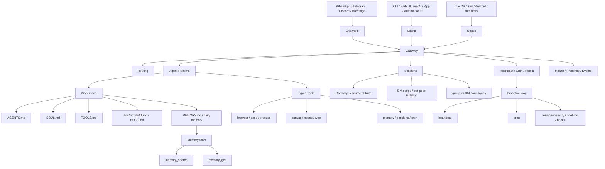

# OpenClaw Architecture Map

## 怎么读这张图

- `Gateway` 是整个系统的控制平面与事实中心
- Channels、Clients、Nodes 都不是各自独立跑 agent，而是接到同一个 Gateway
- Agent runtime 真正吃的是 workspace、tools、sessions、memory
- 主动能力并不是“魔法自进化”，而是 heartbeat、cron、hooks 形成的持续运行机制

## 关于“自进化”

- 官方文档没有把核心机制正式命名为 `self-evolution`
- 更接近的官方机制是：workspace 可编辑、memory 写盘、hooks、heartbeat、cron、boot-md
- 如果 agent 借由这些机制持续改自己的工作文件和记忆，它会表现出一种“准自我迭代”的效果

## 关联

- [[../06-Topics/OpenClaw|OpenClaw]]
- [[../06-Topics/OpenClaw 工作原理与架构|OpenClaw 工作原理与架构]]
- [[AI Agent Systems Map]]
