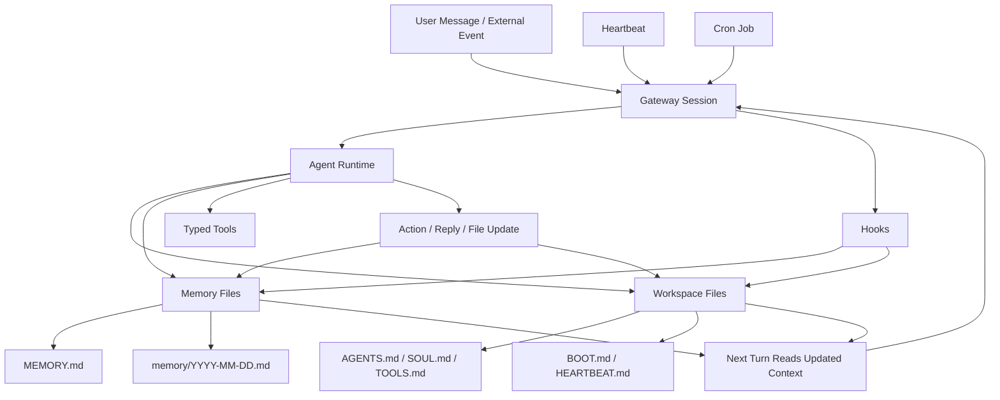

# OpenClaw 准自进化工作流图

## 怎么读这张图

- heartbeat 和 cron 都可以唤醒一次新的 agent turn
- 每次 turn 都不是从零开始，而是读入已经变化过的 workspace 与 memory
- hooks 会在某些事件上自动补充状态
- agent 后续行为之所以“越来越像会自我调整”，关键不在模型变了，而在上下文文件变了

## 这张图最想说明什么

OpenClaw 最接近“自进化”的地方，不是神秘的内核成长，而是：

- 可以持续写
- 可以持续读
- 可以持续触发
- 可以在下次运行里利用上次沉淀

## 关联

- [[../09-Systems/OpenClaw|OpenClaw]]
- [[../09-Systems/OpenClaw|OpenClaw]]
- [[../09-Systems/OpenClaw 工作原理与架构|OpenClaw 工作原理与架构]]
- [[../09-Systems/OpenClaw 的准自进化工作流|OpenClaw 的准自进化工作流]]
- [[OpenClaw Architecture Map]]
