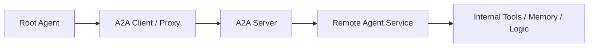
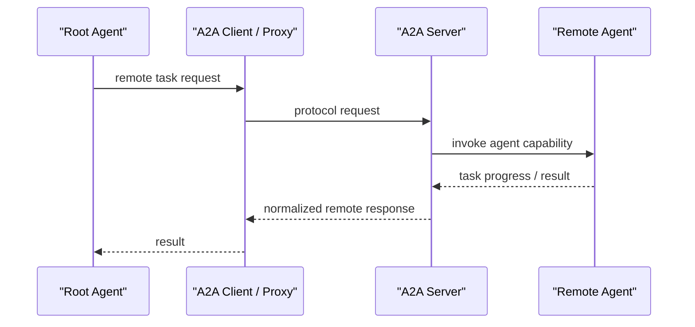

# A2A

## 它解决什么问题

`A2A` 解决的是“独立 agent 服务之间，怎么以标准协议互联和协作，而不是把对方当成普通工具调用”这个问题。

## 为什么现在值得关注

当 agent 开始跨团队、跨服务、跨框架部署时，本地 sub-agent 已经不够了。官方文档明确把 `A2A` 用在 remote agents 场景：一个 agent 可以把另一个独立服务当作 remote agent 使用。来源：[ADK A2A Intro](https://adk.dev/a2a/intro/)、[A2A GitHub](https://github.com/a2aproject/A2A)

## 它在技术生态里的位置

- 属于 `agent-to-agent interoperability`
- 更像 `协议 + 互联层`
- 面向远程 agent 服务，不是本地工具调用
- 和 `MCP` 互补，不是替代关系

## 工作原理

A2A 的核心思路是：

1. 一个 agent 通过 A2A server 暴露自己的能力
2. 另一个 agent 通过 A2A client / proxy 去消费它
3. 双方围绕任务、能力、模态和长任务生命周期进行交互
4. 被调用方仍保持“opaque”——不需要暴露内部 memory、tools 或实现细节

官方仓库描述它是 `An open protocol enabling communication and interoperability between opaque agentic applications.` 来源：[A2A GitHub](https://github.com/a2aproject/A2A)

## 核心组件与架构

- A2A server
- A2A client / proxy
- remote agent
- capability discovery
- task lifecycle
- modality negotiation
- long-running task handling

## 核心对象模型 / 核心抽象

- remote agent
- capability / skill discovery
- task
- task lifecycle
- modality negotiation
- agent card / service description

## 主流程 / 关键链路

### 链路 1：Expose Remote Agent 主链路

1. agent 被包装成 A2A service
2. A2A server 对外暴露能力描述
3. 其他 agent 可以发现并接入它

### 链路 2：Consume Remote Agent 主链路

1. 根 agent 发起任务
2. client/proxy 连接远程 A2A agent
3. 任务在网络上被转发和执行
4. 结果返回给根 agent

### 链路 3：Long-running Task 主链路

1. 远程 agent 执行较长任务
2. 协议跟踪任务生命周期和交互状态
3. 最终结果或中间状态返回给调用方

## 架构图

## 数据流图 / 请求流图

## 工程质量观察

A2A 最值得学的不是某个 SDK，而是它试图把“agent 间协作”从私有集成提升成独立协议层。这个层很像分布式系统里的服务互联，但语义对象换成了 agent。

## 和相邻项目怎么区分

- 和 [[MCP Servers]]：MCP 偏工具/上下文接入；A2A 偏 agent 服务互联
- 和 [[LangGraph]]：LangGraph 偏应用内 orchestration runtime；A2A 偏跨服务边界互联
- 和 [[AutoGen]]：AutoGen 是框架/runtime；A2A 是协议层

## 自托管 / 运行判断

- 本地学习：可以，但通常需要至少两个 agent/service 才更像真场景
- 生产：适合做跨团队、跨框架 agent 协作研究

## 适合什么场景

### 很适合

- 独立 agent 服务互联
- 跨团队或跨框架 agent 协作
- remote specialist agent 模式

### 不太适合

- 单进程内本地 sub-agent 调用
- 只是想接工具，而不是接另一个 agent 服务

## 适配度标签

- local_fit: `medium`
- mac_fit: `medium`
- production_fit: `high`
- learning_fit: `high`
- 解释见：[[../04-Patterns/项目适配度标签说明|项目适配度标签说明]]

## 推荐的学习动作

1. 先理解 `local sub-agent vs remote agent`
2. 再看 expose / consume 两条 quickstart
3. 再把它和 MCP 做边界对照

## 下一步实验建议

- 做一个 `LangGraph + Remote A2A Agent` 实验
- 做一个 `A2A vs MCP` 边界实验：何时接 agent，何时接 tool

## 风险与边界

- 多 agent 互联会把网络、鉴权、生命周期复杂度带进来
- 标准存在不代表生态立即成熟
- 协议层一旦抽象不稳，会导致互操作性表面统一、语义却不一致

## 官方入口

- [A2A GitHub](https://github.com/a2aproject/A2A)
- [ADK A2A Intro](https://adk.dev/a2a/intro/)

## 相关项目

- [[MCP Servers]]
- [[AutoGen]]
- [[LangGraph]]

## 关联

- [[../08-Workflows/开源项目深度分析工作流|开源项目深度分析工作流]]
