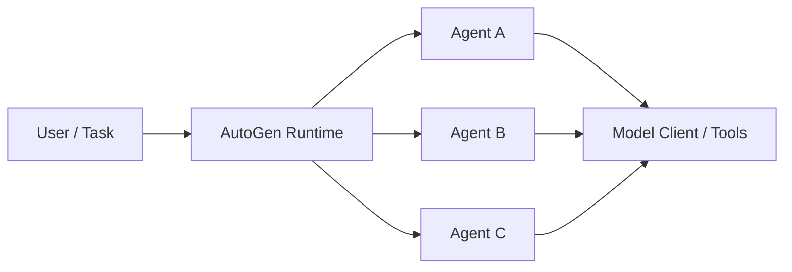
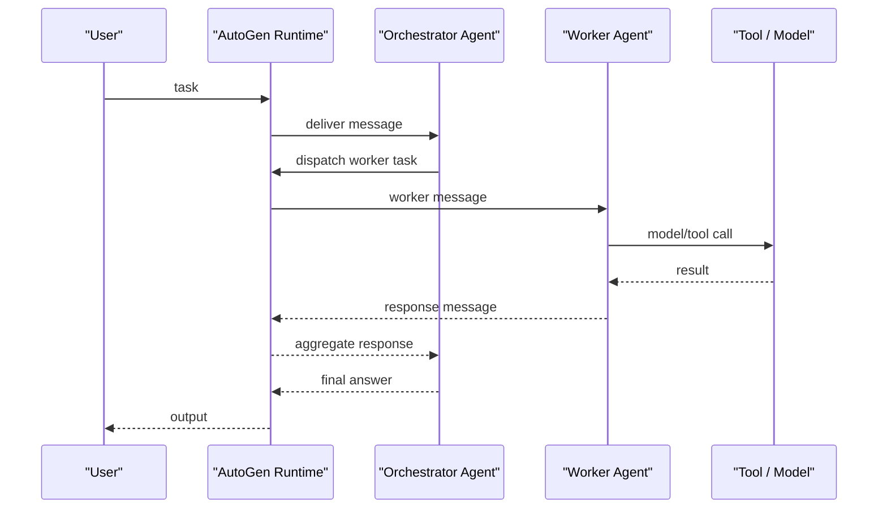

# AutoGen

## 它解决什么问题

`AutoGen` 解决的是“多个 agent 如何通过消息协作、组合成多 agent 应用”这个问题。它不是单个 prompt runner，而是把 agent 看成会通信、会保状态、会执行动作的软件实体。

## 为什么现在值得关注

如果你想研究多 Agent，不只要看 `LangGraph` 这种 workflow runtime，还要看 message-based multi-agent 范式。`AutoGen` 在这条线上很有代表性。来源：[AutoGen Stable Docs](https://microsoft.github.io/autogen/stable/user-guide/core-user-guide/core-concepts/agent-and-multi-agent-application.html)

## 它在技术生态里的位置

- 属于 `multi-agent framework / runtime`
- 更像 `框架 + runtime`
- 强调 agent 之间通过消息协作
- 和 `LangGraph` 互补，不是简单替代关系

## 工作原理

官方文档把 agent 定义为：通过消息通信、维护自身状态、并在收到消息或状态变化后执行动作的软件实体。`AutoGen` 的核心原理是用 runtime 承担 agent 通信、身份、生命周期和边界控制。来源：[AutoGen Stable Docs](https://microsoft.github.io/autogen/stable/user-guide/core-user-guide/core-concepts/agent-and-multi-agent-application.html)、[Agent Runtime Environments](https://microsoft.github.io/autogen/0.5.5/user-guide/core-user-guide/core-concepts/architecture.html)

## 核心组件与架构

- agents
- messages
- runtime
- standalone runtime
- distributed runtime
- tools / workbench / model context
- design patterns: group chat, handoffs, mixture of agents

## 核心对象模型 / 核心抽象

- agent
- runtime
- message
- topic / subscription
- state / lifecycle
- tool / model client

## 主流程 / 关键链路

### 链路 1：Standalone Runtime 主链路

1. 多个 agent 在同一进程内注册到 runtime
2. agent 通过 runtime 相互发消息
3. runtime 管理通信和生命周期
4. agent 根据消息调用 LLM、工具或人工输入

### 链路 2：Distributed Runtime 主链路

1. agent 分布在不同 worker / 机器上
2. host servicer 协调跨 worker 通信
3. gateway 负责连接和代理消息
4. agent 逻辑不变，但运行环境被分布化

### 链路 3：Design Pattern 主链路

1. 定义 worker / orchestrator / handoff 角色
2. 通过消息协作完成任务
3. 多 agent 结果被合成、转发或迭代

## 架构图

## 数据流图 / 请求流图

## 工程质量观察

`AutoGen` 值得学的是：它把“agent 是消息驱动的软件实体”这件事讲得比较彻底，并提供了从 standalone 到 distributed 的连续 runtime 思路。

## 和相邻项目怎么区分

- 和 [[LangGraph]]：`LangGraph` 更偏 state graph/workflow；`AutoGen` 更偏 message-based multi-agent runtime
- 和 [[A2A]]：`A2A` 是跨 agent 服务的互联协议；`AutoGen` 是框架/runtime

## 自托管 / 运行判断

- 本地学习：友好
- 生产：要看你是做研究型 multi-agent，还是要非常强的企业治理

## 适合什么场景

### 很适合

- 学多 Agent 协作模式
- 研究消息驱动 runtime
- 做 orchestrator / worker / handoff 结构实验

### 不太适合

- 你只是想跑单 agent 简单工具调用
- 你更需要固定 workflow 和 durable execution，而不是多 agent 协作

## 适配度标签

- local_fit: `high`
- mac_fit: `high`
- production_fit: `medium`
- learning_fit: `high`
- 解释见：[[../04-Patterns/项目适配度标签说明|项目适配度标签说明]]

## 推荐的学习动作

1. 先跑 standalone 示例
2. 再看 distributed runtime 心智模型
3. 再看 handoff / group chat / mixture of agents 等设计模式

## 下一步实验建议

- 做一个 `AutoGen vs LangGraph` 的多 agent 对照实验
- 做一个 `AutoGen + LiteLLM` 的统一模型接入实验

## 风险与边界

- 多 agent 很容易带来复杂度放大
- message-based 架构如果没有治理，会很难 debug
- 不是所有任务都值得上多 agent

## 官方入口

- [AutoGen GitHub](https://github.com/microsoft/autogen)
- [AutoGen Stable Docs](https://microsoft.github.io/autogen/stable/user-guide/core-user-guide/core-concepts/agent-and-multi-agent-application.html)

## 相关项目

- [[LangGraph]]
- [[A2A]]
- [[LiteLLM]]

## 关联

- [[../08-Workflows/开源项目深度分析工作流|开源项目深度分析工作流]]
