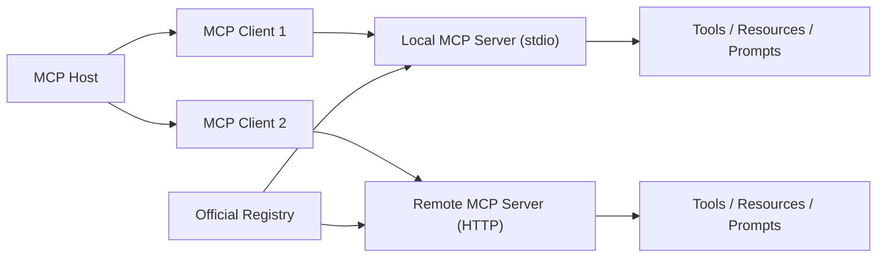
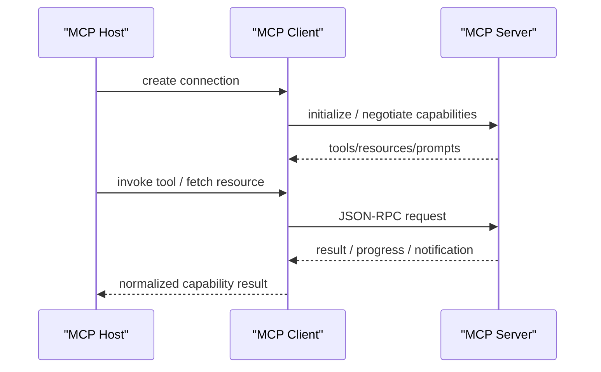

# MCP Servers

## 它解决什么问题

`MCP Servers` 解决的是“AI host 怎么以统一协议接入工具、资源和 prompts，而不是每个工具都写一套私有适配”的问题。它不是单一 repo，而是围绕 `Model Context Protocol` 长出来的 server 生态。

## 为什么现在值得关注

MCP 已经成为很多 agent/runtime 产品研究“标准化工具接入”的关键参照。官方架构文档明确把 MCP 定义成 host-client-server 架构，并把 `tools / resources / prompts` 作为核心原语。来源：[MCP Architecture Overview](https://modelcontextprotocol.io/docs/learn/architecture)

## 它在技术生态里的位置

- 属于 `tool / context protocol ecosystem`
- 更像 `协议 + server 生态`
- 是 host 与外部能力之间的标准接入层
- 常和 `Claude Code`、`OpenAI MCP`、`OpenClaw`、`OpenHands` 等研究路线一起看

## 工作原理

MCP 采用 client-server 架构：

- MCP Host：AI 应用
- MCP Client：host 为每个 server 建立的连接组件
- MCP Server：提供工具、资源和 prompts 的程序

协议分两层：

- data layer：JSON-RPC 语义、capabilities、tools/resources/prompts/notifications
- transport layer：`stdio` 和 `Streamable HTTP`

这意味着它不是某个 SDK 的插件接口，而是一套通用的上下文与动作交换协议。来源：[MCP Architecture Overview](https://modelcontextprotocol.io/docs/learn/architecture)、[MCP Tools](https://modelcontextprotocol.io/specification/draft/server/tools)

## 核心组件与架构

- MCP Host
- MCP Client
- MCP Server
- tools
- resources
- prompts
- stdio transport
- Streamable HTTP transport
- registry

## 核心对象模型 / 核心抽象

- host
- client
- server
- capability negotiation
- tool
- resource
- prompt
- notification / progress
- transport

## 主流程 / 关键链路

### 链路 1：本地 stdio server 主链路

1. host 启动本地 server 进程
2. host 为该 server 建立 MCP client
3. client 通过 stdio 和 server 交换 JSON-RPC 消息
4. host 获得 tools/resources/prompts

### 链路 2：远程 HTTP server 主链路

1. host 连接远程 MCP server
2. 完成 capability negotiation 和 auth
3. server 提供远程 tools/resources/prompts
4. host 在运行时调用这些能力

### 链路 3：Registry / Server 生态主链路

1. 开发者在 registry 中发现 server
2. 选择 local / remote server
3. 将其接入 host
4. 在 agent/runtime 中复用相同接入方式

## 架构图

## 数据流图 / 请求流图

## 工程质量观察

MCP 最值得学的是：它把工具接入从“私有插件接口”提升成了 host/server 分离的协议层，这非常适合做长期的 agent 扩展生态。

## 和相邻项目怎么区分

- 和 plugin：plugin 更像宿主内的私有扩展；MCP 更像跨产品复用的协议层
- 和 [[A2A]]：MCP 面向工具和上下文接入；A2A 面向 agent-to-agent 互联

## 自托管 / 运行判断

- 本地实验：很友好，尤其 stdio server
- 生产：适合，但 server 安全、权限和数据边界必须严肃设计

## 适合什么场景

### 很适合

- 标准化工具接入
- 把内部系统能力暴露给多个 host
- 将工具、资源和 prompt 解耦出 agent runtime

### 不太适合

- 你需要的是 agent 间协作协议，而不是工具协议
- 你的能力只在单一宿主里使用，不打算复用

## 适配度标签

- local_fit: `high`
- mac_fit: `high`
- production_fit: `high`
- learning_fit: `high`
- 解释见：[[../04-Patterns/项目适配度标签说明|项目适配度标签说明]]

## 推荐的学习动作

1. 先读架构文档
2. 再看 registry 里的真实 server
3. 再自己实现一个最小本地 server

## 下一步实验建议

- 做一个本地 `MCP server + Codex/OpenClaw host` 实验
- 对比 `MCP` 和 `plugin` 的工程边界

## 风险与边界

- server 权限边界和数据外泄风险高
- 远程 server 的 auth、CORS、transport 选择会影响安全模型
- registry 热闹不等于每个 server 都成熟可靠

## 官方入口

- [MCP Architecture Overview](https://modelcontextprotocol.io/docs/learn/architecture)
- [Official MCP Registry](https://registry.modelcontextprotocol.io/)
- [MCP Tools Spec](https://modelcontextprotocol.io/specification/draft/server/tools)

## 相关项目

- [[A2A]]
- [[OpenClaw]]
- [[OpenHands]]

## 关联

- [[../08-Workflows/开源项目深度分析工作流|开源项目深度分析工作流]]
