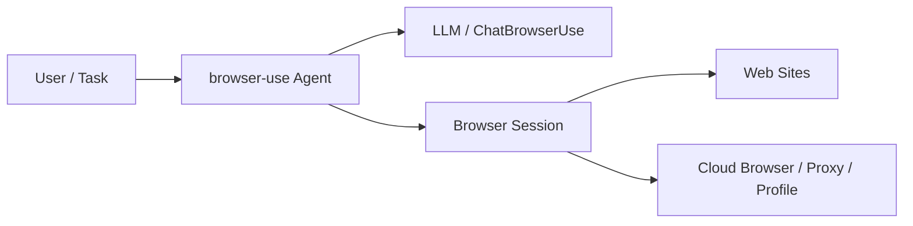
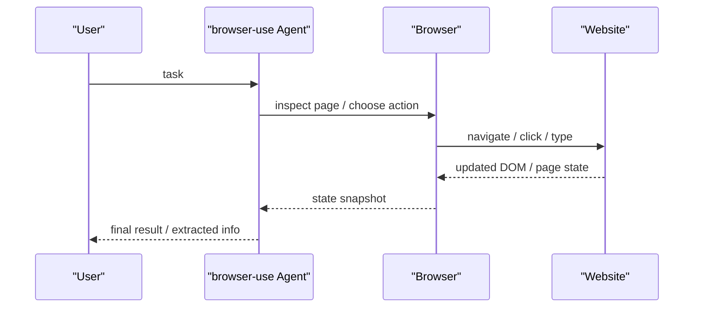

# browser-use

## 它解决什么问题

`browser-use` 解决的是“AI agent 如何真正操作网页，而不只是调用 API”这个问题。它把网页浏览器变成 agent 的动作面，让 agent 可以导航页面、填写表单、读取内容、执行交互。

## 为什么现在值得关注

如果你在研究 browser / desktop agent，`browser-use` 是很重要的开源样本。官方文档明确把它定位成 `AI browser automation`，并区分了 `Agent` 和 `Browser` 两种模式。来源：[Browser Use Docs](https://docs.browser-use.com/cloud/quickstart)、[browser-use GitHub](https://github.com/browser-use/browser-use)

## 它在技术生态里的位置

- 属于 `browser action surface`
- 更像 `动作 runtime + 执行层`
- 常和 coding agent、workflow agent、QA agent 结合
- 不是编排框架，也不是模型网关

## 工作原理

它的核心原理是把 LLM/agent 放到浏览器旁边，让 agent 通过浏览器状态理解页面，再执行导航和交互动作。官方文档还强调：既可以用 `Agent` 模式直接完成任务，也可以用 `Browser` 模式直接拿到原始浏览器。来源：[Browser Use Docs](https://docs.browser-use.com/cloud/quickstart)

## 核心组件与架构

- Agent
- Browser
- ChatBrowserUse / model side
- cloud browsers / stealth browsers
- profiles / proxies / recordings
- local browser or cloud browser

## 核心对象模型 / 核心抽象

- task
- agent
- browser session
- profile
- proxy
- tool/action set
- history / run result

## 主流程 / 关键链路

### 链路 1：本地 Agent 主链路

1. 用户定义 task
2. agent 读取浏览器状态
3. agent 决定下一步网页动作
4. 浏览器执行动作并返回新状态
5. 循环直到任务完成

### 链路 2：Cloud Browser 主链路

1. 本地或远端 agent 请求 cloud browser
2. cloud browser 提供带代理、配置和持久会话的浏览器环境
3. agent 在远程浏览器上执行动作

### 链路 3：Raw Browser / CDP 主链路

1. 客户端创建 browser
2. 通过 CDP 或浏览器对象直接操作页面
3. 不一定走完整 agent reasoning 流

## 架构图

## 数据流图 / 请求流图

## 工程质量观察

`browser-use` 最值得学的是：它把“浏览器是动作面”这件事做成了显式 runtime，而不是把网页操作藏在黑盒里。

## 和相邻项目怎么区分

- 和 Playwright：Playwright 更偏确定性脚本自动化；`browser-use` 更偏 LLM agent 驱动的网页执行
- 和 [[OpenHands]]：`OpenHands` 更偏 coding agent 平台；`browser-use` 更偏网页动作能力

## 自托管 / 运行判断

- 本地实验：很友好
- 生产使用：如果涉及并发、大量会话、反爬和 CAPTCHA，更适合云化或专用浏览器基础设施

## 适合什么场景

### 很适合

- 网页操作型 agent
- form fill / search / extract / QA automation
- 研究 browser action surface

### 不太适合

- 纯 API 任务
- 需要极端确定性和可重复脚本的场景
- 不希望承受 UI 波动和页面脆弱性

## 适配度标签

- local_fit: `high`
- mac_fit: `high`
- production_fit: `medium`
- learning_fit: `high`
- 解释见：[[../04-Patterns/项目适配度标签说明|项目适配度标签说明]]

## 推荐的学习动作

1. 先跑 quick start
2. 区分 Agent 模式和 Browser 模式
3. 再思考它怎么接进 `OpenHands / OpenClaw / Harness`

## 下一步实验建议

- 做一个 `browser-use + LiteLLM` 的浏览器 agent 实验
- 做一个 `browser-use + Langfuse` 的网页操作观测实验

## 风险与边界

- 网页动作高度脆弱，容易受页面变更影响
- CAPTCHA、登录态、反爬和代理问题很重
- 生产规模化会把浏览器基础设施变成瓶颈

## 官方入口

- [Browser Use Docs](https://docs.browser-use.com/cloud/quickstart)
- [browser-use GitHub](https://github.com/browser-use/browser-use)

## 相关项目

- [[OpenHands]]
- [[LiteLLM]]
- [[Langfuse]]

## 关联

- [[../08-Workflows/开源项目深度分析工作流|开源项目深度分析工作流]]
